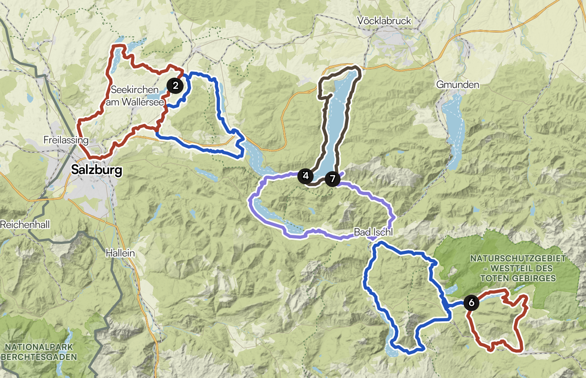

# Vacances vélo + rando au Salzkammergut en Août 2026

## Planning + Campings

### J-N : 
Les Toulonnais visitent l'Italie pour se rapprocher

### Jour 0 : lundi 3 août 2026
Trajet routier jusqu'à Salzburg (9h30 depuis Auxerre)
on irait directement au camping au Wallersee. 
*Premier camping : du 3/08 au 7/08*
Par exemple : 
* Neumarkt Strandbad Seecamp
Site : https://www.neumarkt.at/Strandbad_Seecamp
Google : https://maps.app.goo.gl/GL55Mviz2bLPTU5f7
* Camping Fenninger­spitz
Site https://www.camping-fenningerspitz.at/
Google :https://maps.app.goo.gl/o2Yq6fbmH1ggGMQ2A
* Strandbad & Camping Seekirchen
Site : https://camping-seekirchen.at/
Google : https://maps.app.goo.gl/hEDtHw4SqRMYdKuz7

### Jour 1 : mardi 4 août 2026
Repos / Visite de Salzburg

https://www.salzburg.info/fr

### Jour 2 : mercredi 5 août 2026
Wallersee1
<iframe src="https://www.komoot.com/fr-fr/tour/2765397044/embed?share_token=aR9z4DmaVX98Bl16u4EX4J7d9vZshFUdqXqqe0AEAumBumAb50&amp;layout=gallery&amp;profile=1" width="100%" height="700" frameborder="0" scrolling="no"></iframe>

### Jour 3 : jeudi 6 août 2026
Wallersee2
<iframe src="https://www.komoot.com/fr-fr/tour/2765400498/embed?layout=gallery&amp;profile=1" width="100%" height="700" frameborder="0" scrolling="no"></iframe>

### Jour 4 : vendredi 7 août 2026
Transit jusqu'à Mondsee + Rando à prévoir

*Deuxième camping : du 7/08 au 10/08 :*
* Hideaway Attersee
Site https://hideaway-attersee.at/
Google https://maps.app.goo.gl/B8vBFSVbR9Z139pY7

* Camping Grabner 
Site https://www.camping-grabner.at/en/
Google : https://maps.app.goo.gl/CKRBm4CmjUJ5k4jo9
(nécessite de rallonger légèrement Attersee 1, pas d'effet sur Attersee 2)
* Camping Seestern
Site https://guide.camping-club.de/campings/293
Google : https://maps.app.goo.gl/E1hLoQoXUHyYQL4A7  
E-Mail:
    info@attersee.at (très curieux de savoir si c'est le bon mail, il y a déjà confusion des sites web entre Attersee et Mondsee sur Google !)
    Telefon:
    0043 664 3414131
    PAS DE SITE WEB
Avis google : pas très clair si OK pour durées réduites ; "Il est important de savoir que ce camping est uniquement destiné aux séjours de longue durée ; il n’est donc pas possible d’y passer une ou deux nuits… Cependant, cette information nous vient de clients qui venaient d’arriver." A l'inverse d'autres y ont passé seulemnt deux nuits, tout en signalant que majoritairement des séjours de longue durée.
Nécessite de changer le trajet komoot 

REMARQUE:
Camping sur komoot (prévu initialement) FERMÉ POUR LA SAISON
`

*Rando possible (exemple)*
<iframe src="https://www.komoot.com/fr-fr/tour/2765514371/embed?layout=gallery&amp;profile=1" width="100%" height="700" frameborder="0" scrolling="no"></iframe>

### Jour 5 : samedi 8 août 2026
Attersee1
<iframe src="https://www.komoot.com/fr-fr/tour/2765415369/embed?layout=gallery&amp;profile=1" width="100%" height="700" frameborder="0" scrolling="no"></iframe>

### Jour 6 : dimanche 9 août 2026
Attersee2
<iframe src="https://www.komoot.com/fr-fr/tour/2765426224/embed?layout=gallery&amp;profile=1" width="100%" height="700" frameborder="0" scrolling="no"></iframe>

### Jour 7 : lundi 10 août           2026
Transit jusqu'à Badaussee + Rando à prévoir

*Troisième Camping du 10/08 au 14/08*
Plusieurs possibilités, à confirmer. Nécessite de changer un peu le trajet komoot
* Un premier camping un peu loin en altitude :
Site : https://www.camping-altaussee.com/en/
Google : https://maps.app.goo.gl/7EFfLQvhx7TJrqLU8

* Deuxième camping (minimum 5 jours pour la résa sur leur site, on n'y reste que 4 nuits)
Site :  https://www.staudnwirt.at/
Google : https://maps.app.goo.gl/PWmQSfd9MUtnBXoY7

### Jour 8 : mardi 11 août 2026
Badaussee1
<iframe src="https://www.komoot.com/fr-fr/tour/2765435042/embed?layout=gallery&amp;profile=1" width="100%" height="700" frameborder="0" scrolling="no"></iframe>

### Jour 9 : mercredi 12 août 2026
Badaussee2
<iframe src="https://www.komoot.com/fr-fr/tour/2765437040/embed?layout=gallery&amp;profile=1" width="100%" height="700" frameborder="0" scrolling="no"></iframe>

### Jour 10 : jeudi 13 août 2026
Rando Naturschutzgebiet Westteil des toten Gebirges
Exemple avec trop de dénivelé, à revoir : 

<iframe src="https://www.komoot.com/fr-fr/tour/2929833845/embed?share_token=akrDF0Iz0sYP4I7Sp7KoChVu1U8pUzQMmQuPF0pWL5VqX5J4QY&amp;layout=gallery&amp;gallery=1" width="100%" height="640" frameborder="0" scrolling="no"></iframe>

### Jour 11 : vendredi 14 août 2026
Retour en Alsace (Strasbourg) ; environ 5 h de route. Peut-être possibilité de voir Eva+Charlène
Visite de Strasbourg
### Jour 12 : samedi 15 août 2026
Balade dans la vallée des vins en Alsace

Par exemple (à rallonger):
<iframe src="https://www.komoot.com/fr-fr/tour/2929959066/embed?share_token=a9Yd4MSFp1X6A9m48UttE6DeqnFgME7zO3HGaqOKsvV791PtL2&amp;layout=gallery&amp;gallery=1" width="100%" height="640" frameborder="0" scrolling="no"></iframe>

### Jour 13 : dimanche 16 août 2026
Retour à la maison (5h)
