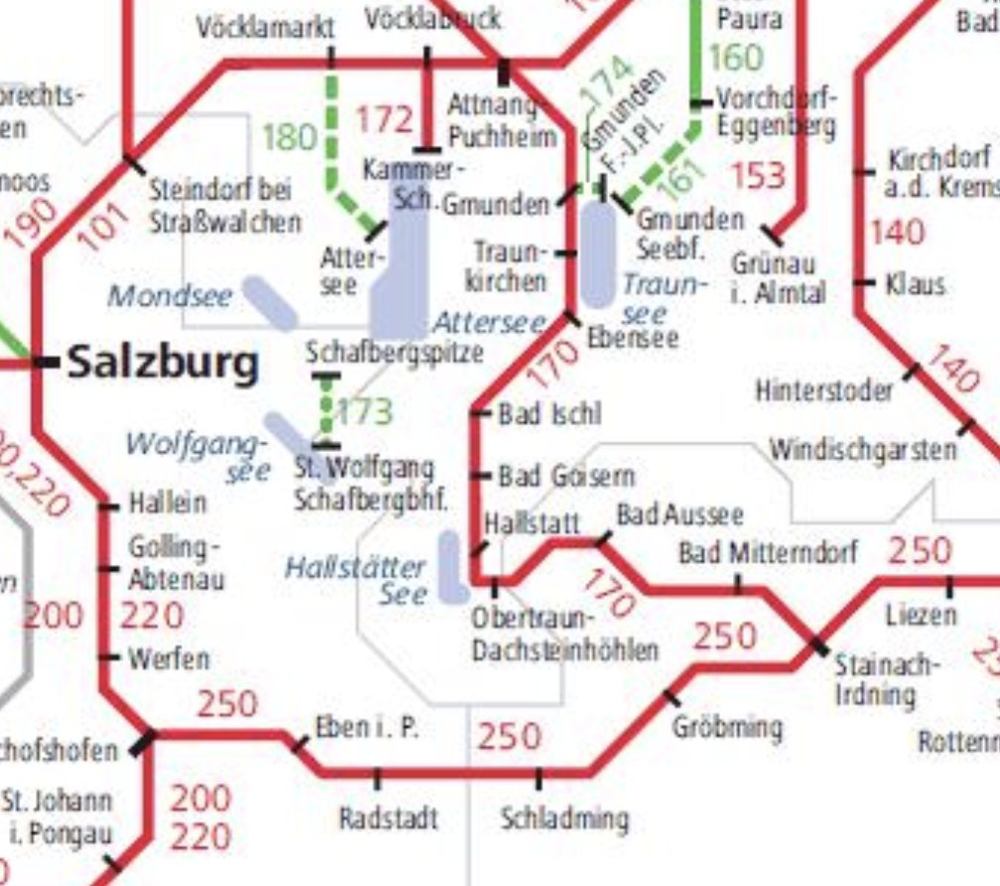

# Vacances vélo + rando au Salzkammergut en Août 2026

Lien vers la oebb : 
https://www.oebb.at/en/

## Campings
(autres choix possibles, à confirmer)

| Date | Nom du camping | Site | Google |
| --- | --- | --- | --- |
| du 3/08 au 7/08 | Camping Fenningerspitz | [site](https://www.camping-fenningerspitz.at/) | https://maps.app.goo.gl/o2Yq6fbmH1ggGMQ2A |
| du 7/08 au 10/08 | Föttinger Attersee | [site](https://www.hotel-attersee.at/index.php?id=24) | https://maps.app.goo.gl/T5WZK8WGiCR7wxwZ7|
| du 10/08 au 14/08 | Camping Altaussee | [site](https://www.camping-altaussee.com/en/) | https://maps.app.goo.gl/7EFfLQvhx7TJrqLU8 | 

## Planning

### J-N : 
Les Toulonnais visitent l'Italie pour se rapprocher

### Jour 0 : lundi 3 août 2026
Trajet routier jusqu'à Salzburg (9h30 depuis Auxerre)
on irait directement au camping au Wallersee.

*Premier camping : du 3/08 au 7/08*

| Camping Fenningerspitz | https://www.camping-fenningerspitz.at/ | https://maps.app.goo.gl/o2Yq6fbmH1ggGMQ2A |

### Jour 1 : mardi 4 août 2026
Repos / Visite de Salzburg (20 minutes en voiture depuis le camping)

https://www.salzburg.info/fr

### Jour 2 : mercredi 5 août 2026
Wallersee1

Version courte : 
<iframe src="https://www.komoot.com/fr-fr/tour/2934073761/embed?share_token=a04gk2OHBkY8OeTKJgNI5vsuOOfNN1ivQpTukbHzlVbSIPEjf6&amp;layout=gallery&amp;gallery=1" width="100%" height="640" frameborder="0" scrolling="no"></iframe>

L'ancienne version plus longue :
<iframe src="https://www.komoot.com/fr-fr/tour/2933648831/embed?share_token=awDk3D47zNNDmYRedjLUp73CMNKjH3USOoxqw2YqStqyjQkli9&amp;layout=gallery&amp;gallery=1" width="100%" height="640" frameborder="0" scrolling="no"></iframe>

### Jour 3 : jeudi 6 août 2026
Wallersee2
<iframe src="https://www.komoot.com/fr-fr/tour/2765400498/embed?layout=gallery&amp;profile=1" width="100%" height="700" frameborder="0" scrolling="no"></iframe>

### Jour 4 : vendredi 7 août 2026
Transit jusqu'à Mondsee + Rando à prévoir

*Deuxième camping : du 7/08 au 10/08 :*

| Föttinger Attersee | https://www.hotel-attersee.at/index.php?id=24 | https://maps.app.goo.gl/T5WZK8WGiCR7wxwZ7 |

*Rando possible (exemple)*
<iframe src="https://www.komoot.com/fr-fr/tour/2765514371/embed?layout=gallery&amp;profile=1" width="100%" height="700" frameborder="0" scrolling="no"></iframe>

### Jour 5 : samedi 8 août 2026
Attersee1
<iframe src="https://www.komoot.com/fr-fr/tour/2765415369/embed?layout=gallery&amp;profile=1" width="100%" height="700" frameborder="0" scrolling="no"></iframe>

### Jour 6 : dimanche 9 août 2026
Attersee2
<iframe src="https://www.komoot.com/fr-fr/tour/2765426224/embed?layout=gallery&amp;profile=1" width="100%" height="700" frameborder="0" scrolling="no"></iframe>

### Jour 7 : lundi 10 août           2026
Transit jusqu'à Badaussee + Rando à prévoir

*Troisième Camping du 10/08 au 14/08*

| Camping au pied des alpages | https://www.camping-altaussee.com/en/ | https://maps.app.goo.gl/7EFfLQvhx7TJrqLU8 |

### Jour 8 : mardi 11 août 2026
Badaussee1 modifié
<iframe src="https://www.komoot.com/fr-fr/tour/2930828887/embed?share_token=abmiYNaAFPNdaWY41Df9u8jBFKbFkDesXUeKKOmIpjaR7FFKod&amp;layout=gallery&amp;gallery=1" width="100%" height="640" frameborder="0" scrolling="no"></iframe>

### Jour 9 : mercredi 12 août 2026
Badaussee2 modifié
<iframe src="https://www.komoot.com/fr-fr/tour/2930872695/embed?share_token=a1UVtcNBCAFr0xmn5wvfbC3qElvfE5ia1wU5w03caLPT2rml13&amp;layout=gallery&amp;gallery=1" width="100%" height="640" frameborder="0" scrolling="no"></iframe>

### Jour 10 : jeudi 13 août 2026
Rando Naturschutzgebiet Westteil des toten Gebirges
Exemple avec trop de dénivelé, à revoir : 

<iframe src="https://www.komoot.com/fr-fr/tour/2929833845/embed?share_token=akrDF0Iz0sYP4I7Sp7KoChVu1U8pUzQMmQuPF0pWL5VqX5J4QY&amp;layout=gallery&amp;gallery=1" width="100%" height="640" frameborder="0" scrolling="no"></iframe>

Autre balade beaucoup plus facile :

<iframe src="https://www.komoot.com/fr-fr/tour/2930969426/embed?share_token=a6AXFc7PYSVBaP8vRxtLVb4jG1ULixQOk8vsSJBl0P3MrktKK2&amp;layout=gallery&amp;gallery=1" width="100%" height="640" frameborder="0" scrolling="no"></iframe>

### Jour 11 : vendredi 14 août 2026
Retour en Alsace (Strasbourg) ; environ 5 h de route. Peut-être possibilité de voir Eva+Charlène
Visite de Strasbourg
### Jour 12 : samedi 15 août 2026
Balade dans la vallée des vins en Alsace

Par exemple (à rallonger):
<iframe src="https://www.komoot.com/fr-fr/tour/2929959066/embed?share_token=a9Yd4MSFp1X6A9m48UttE6DeqnFgME7zO3HGaqOKsvV791PtL2&amp;layout=gallery&amp;gallery=1" width="100%" height="640" frameborder="0" scrolling="no"></iframe>

### Jour 13 : dimanche 16 août 2026
Retour à la maison (5h)
